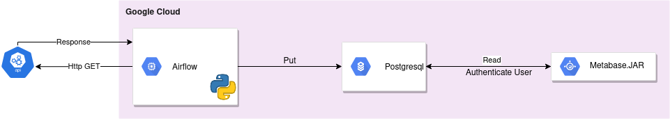

# Covid Brasil 19 - Releitura
O projeto tem como objetivo realizar uma releitura dos dados divulgados pelo [Ministério da Saúde](https://covid.saude.gov.br/) utilizando tecnologias Open Source e aprendizado.
- [Link do relatório](https://cutt.ly/ayBOdsc)

[![Py][python-image]][python-url]
[![Airflow][airflow-image]][airflow-url]

## Requisitos:
- [Python 3.x](python-url)
- [PostgreSQL](postgres-url)
- [Apache Airflow](airflow-url)

## Histórico de Versão

* 0.0.1
    * CHANGE: Commit project

## Developer

Lucas Mari – [@LHRM97](https://twitter.com/LHRM97) – lucashrm97@gmail.com

[https://github.com/Amglsox](https://github.com/dbader/)

<!-- Markdown link & img dfn's -->
[python-image]: https://camo.githubusercontent.com/1ffe5b1d477c7a0a8c3a954048fb57d676ac1614/68747470733a2f2f696d672e736869656c64732e696f2f707970692f707976657273696f6e732f6b756265726e657465732e737667
[python-url]: https://www.python.org/
[airflow-image]:https://camo.githubusercontent.com/a0f8662456135c05bf3117cb70a1aaa55c0d3604/687474703a2f2f696d672e736869656c64732e696f2f3a6c6963656e73652d417061636865253230322d626c75652e737667
[airflow-url]:https://airflow.apache.org/
[postgres-url]: https://www.postgresql.org/
